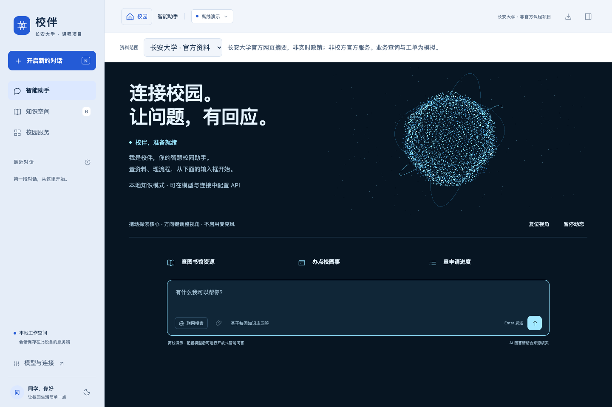
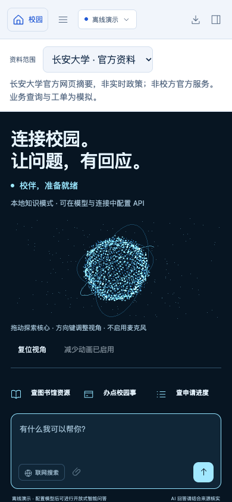
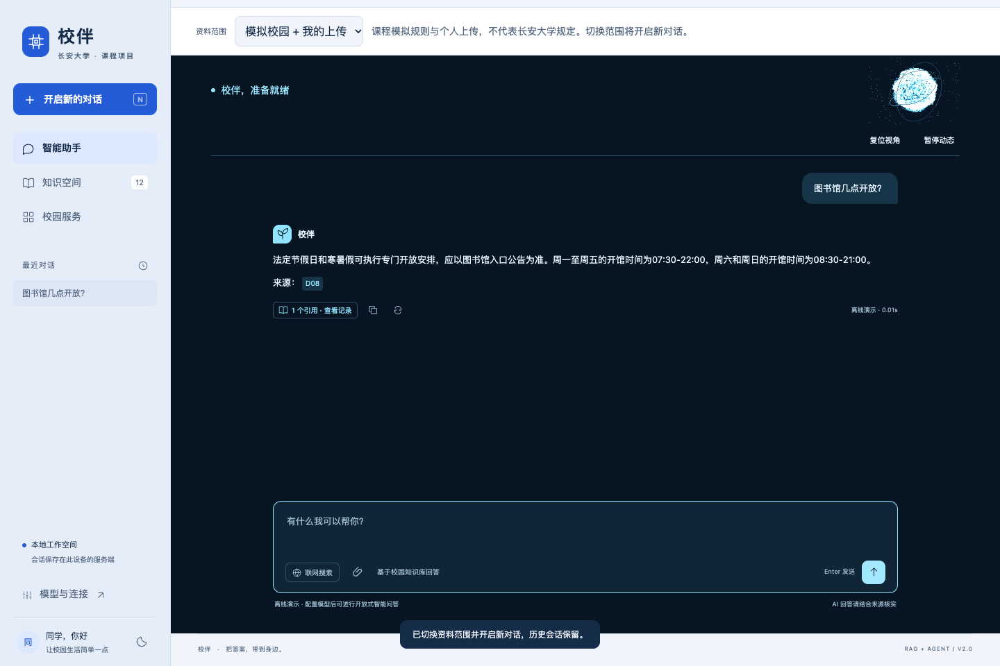

# 长安知行离子核心：三维助手入口

点击主页“开始使用智慧校园助手”进入现有 Agent，同页载入青蓝色三维粒子核心。不是视频、GIF或阻塞式开场；输入框与模型设置、联网、RAG、会话功能继续可用。地图和七处校园实景不变。

## 交互

- 进入时粒子从外侧聚合，形成球形核心与三条空间轨道；约750ms聚合不阻止输入。
- 鼠标靠近带来轻微空间响应；拖动旋转，方向键调整，Home或“复位视角”复位。
- “暂停动态”停止渲染循环；系统减少动画偏好展示静态三维姿态。
- 发送真实问题时由工作台的 `busy` 状态驱动“正在处理”与暖色能量变化；请求结束恢复就绪。没有虚假CPU数值、联网成功提示或扫描百分比。
- 对话开始后核心收拢为小型状态区，留出答案和来源空间。切换知识页、返回校园、离开可见区域或后台标签时停止循环。
- WebGL不可用或模块加载失败时保留静态示意和实际输入功能；不申请麦克风权限，不实现语音助手，不表示具备影视助手的能力。

## 技术与来源

参考 Three.js 官方[自定义属性粒子示例](https://threejs.org/examples/webgl_custom_attributes_points.html)、[交互粒子示例](https://threejs.org/examples/webgl_interactive_points.html)及[粒子波浪](https://threejs.org/examples/webgl_points_waves.html)的实现方向，使用项目已有本地 Three.js 编写点几何、GLSL形变、透视相机和交互控制。没有抓取影视画面或外部演示成品。

代码：`static/ion-assistant.js`、`static/ion-assistant.css`，通过 `app.js` 非阻塞加载；`workbench.html` 同时用于内嵌与独立入口。桌面4800个核心粒子、手机2200个，另有200个背景点；DPR上限分别1.5/1.2。不采用全屏Bloom、多通道模糊或额外动画库。GPU顶点着色器处理形变，不逐帧修改数千个DOM元素。“离子”是视觉命名，不是物理模拟或系统负载可视化。

## 验证与截图

独立复核补充3项[失败恢复检查](../04_Evaluation/ion_recovery_results.json)：真实WebGL上下文丢失/恢复、WebGL初始化失败、三维模块加载失败。均验证不可用控件隐藏或恢复；后两项通过实际RAG请求验证文本状态仍随请求变化。状态同步放在工作台中，不依赖可选三维模块成功加载。

运行 `node tests/ion_assistant_smoke.cjs`，10项检查通过，见[验证记录](../04_Evaluation/ion_assistant_results.json)。另有13项[既有导航回归](../04_Evaluation/ion-navigation_navigation.json)和61项Python测试通过。检查为本机Headless Chrome合成功能验证，不等于实体手机60fps保证或真实大模型质量评测。静态截图仅说明构图；暂停、真实RAG状态、草稿、降级等由浏览器检查验证。

