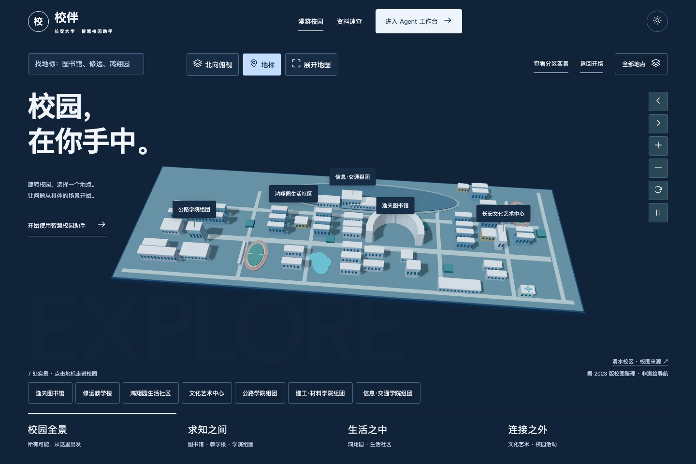
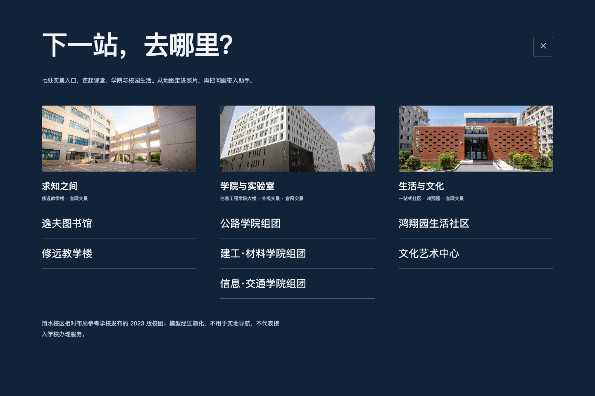
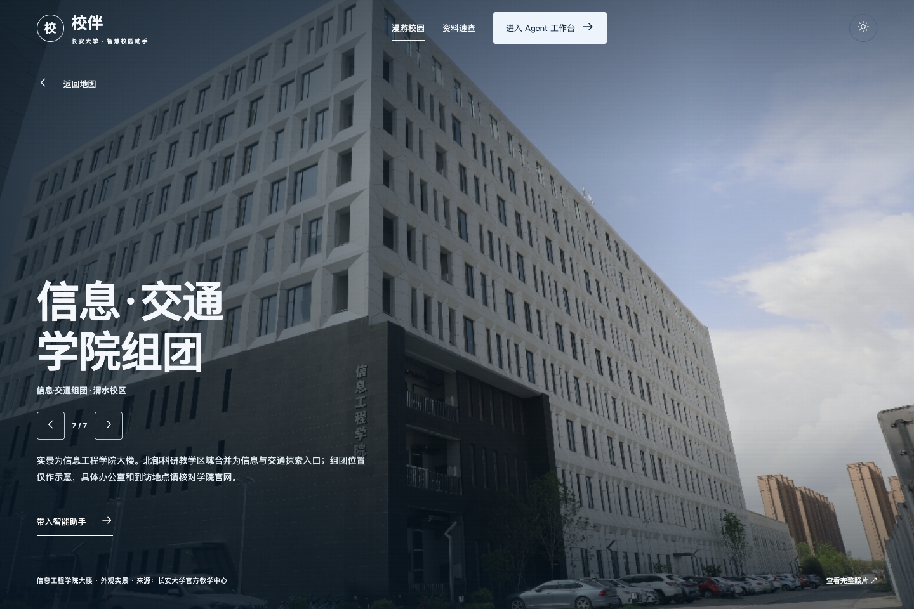
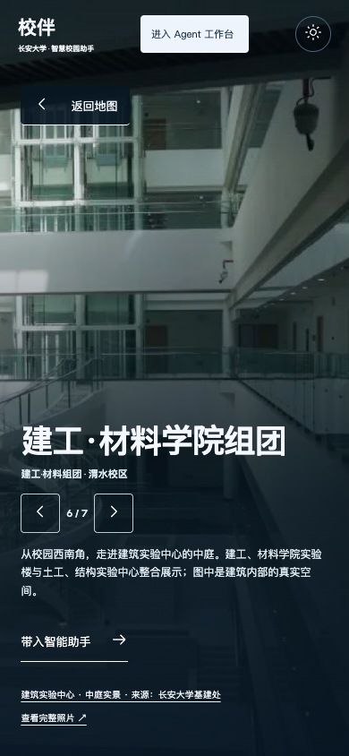

# 地标进入实景：连续剪辑式转场

## 当前体验

点击地图上有实景的地标，三维镜头向建筑推进；提前解码的对应照片以同向轻微推近、透明度叠化接成全屏背景，随后出现地标标题、说明及“带入智能助手”。不是把照片放进侧边弹窗。返回地图用更短的反向叠化，恢复点击前的角度、缩放和分区。

| 入口 | 对应实景 | 地图范围 |
|---|---|---|
| 逸夫图书馆 | 长安大学官网“北校区逸夫图书馆” | 图书馆 |
| 修远教学楼 | 官网“修远教学楼” | 修远教学区，不把明远/鸿远照片混用 |
| 鸿翔园生活社区 | 官网“一站式社区-鸿翔园” | 西侧对应住宿组团；东侧和更西侧宿舍仅作非交互背景 |
| 文化艺术中心 | 官网“长安文化艺术中心” | 东侧艺术中心 |
| 公路学院组团 | 基建处公路基础设施创新建设平台建成档案外观 | 西侧公路学院综合楼与实验设施 |
| 建工·材料学院组团 | 基建处建筑实验中心中庭实景 | 西南侧建工、材料及土工、结构实验组团 |
| 信息·交通学院组团 | 官方教学中心“信息工程学院大楼”照片 | 北部科研教学组团示意，不是精确楼门定位 |

依照用户“没有实景的部分可以删除”，6项无配图服务入口已移出地图；随后按“增加学院楼、相近的可整合”的要求，扩展为上述7处实景。三类目录为求知之间、学院与实验室、生活与文化。其余建筑保留背景几何；Agent工作台的模型配置、RAG、联网、会话与工具能力不受影响。

## 新增图片来源与边界

检索尝试包含百度；百度结果页未能直接读取，因此最终均回溯学校官方页面核验，不将搜索缩略图或效果图作为实景。新增照片本地压缩加载，点击图片来源可打开各自原始文章。

| 本地展示文件 | 官方来源与原图 | 类型 |
|---|---|---|
| `chd-highway-web.jpg` | [基建处项目介绍](https://jjc.chd.edu.cn/2018/1109/c747a52265/page.htm)；原图 `bfd0e903-dda7-44fb-a449-ab3677c2731d_d.jpg` | 建成档案外观，含周边施工痕迹；不是实时校园状况 |
| `chd-materials-web.jpg` | [建筑实验中心项目](https://jjc.chd.edu.cn/2018/1109/c747a52266/page.htm)；原图 `2f86e5bb-1a9b-4c00-ad66-2bf03ccd282e_d.jpg` | 建成后中庭照片，不冒充外立面 |
| `chd-information-web.jpg` | [官方教学中心转载的学院介绍](https://ticvse.chd.edu.cn/info/1010/1376.htm)；图4，原图 `996A9AC478B2AC1D7518E44E150_581DE751_56965.jpeg` | 信息工程学院大楼实景，不代表组团所有学院共享同一楼 |

北校区智通大厦与信息工程学院的关系另由[学院消防演练报道](https://webplus.chd.edu.cn/_s193/2025/1229/c7383a258093/page.psp)确认；北部创新平台位置参考[基建处介绍](https://jjc.chd.edu.cn/2023/0509/c747a230392/page.htm)及2023版校图。学院组团是本界面的探索分组，不冒充官方行政命名或精确导航。尚未收录对应业务政策，咨询仍需核实来源。

原始图存于 `assets-source/chd/`，运行图片位于 `02_Python_Version/static/assets/campus-open-day/`。官网公开展示不等于免费商用授权；本地课程演示保留出处，公开发布、再分发前应确认权利，详见[开放日说明](OPEN_DAY_DESIGN.md)。

## 实现与边界

- 图片本地化并预解码，使用两层图片叠化；不加动效库，不依赖外部图片服务或整页截图转场。
- 首次进入：图片760ms、重叠延迟100ms；文字延迟320ms后用400ms呈现。相邻照片切换620ms，退出420ms。相机在运动时按刷新帧绘制，实景稳定后停止地图绘制。
- 版本号使快速连点、提前返回的过期图片与动画失效。地图底层控件不可聚焦，照片来源、返回和Agent入口保持可用。
- 减少动画偏好直接显示相同照片与内容。图片加载失败明确提示并回到可操作地图/普通服务面板，不展示空白全屏；WebGL失败仍可通过目录进入实景。
- 这是连续视觉叠化，不是建筑照片与三维模型的几何重建或像素级变形。地图仍仅依据2023版校图的相对布局，非GPS导航。

## 验证

`tests/landmark_film_smoke.cjs` 的13项检查覆盖7入口边界、目录、镜头推进/中间透明度、全背景尺寸、七张图片及来源对应、返回镜头保持、快速打断、Agent草稿不自动发送、390px界面、学院搜索、减少动画、图片失败与WebGL失败。证据：[学院实景转场检查](../04_Evaluation/college_film_results.json)。

13项既有Agent导航回归通过，证据 `04_Evaluation/college-film-navigation_navigation.json`；61项Python测试通过。检查在本机Headless Chrome完成，不承诺所有实体手机稳定60fps。旧 `landmark-film` 为4入口阶段，`weishui` / `open_day` 为更早阶段记录，不作为当前7入口版本的直接复现命令。

