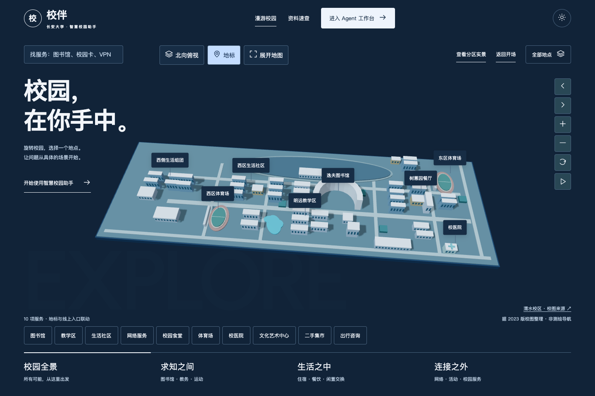
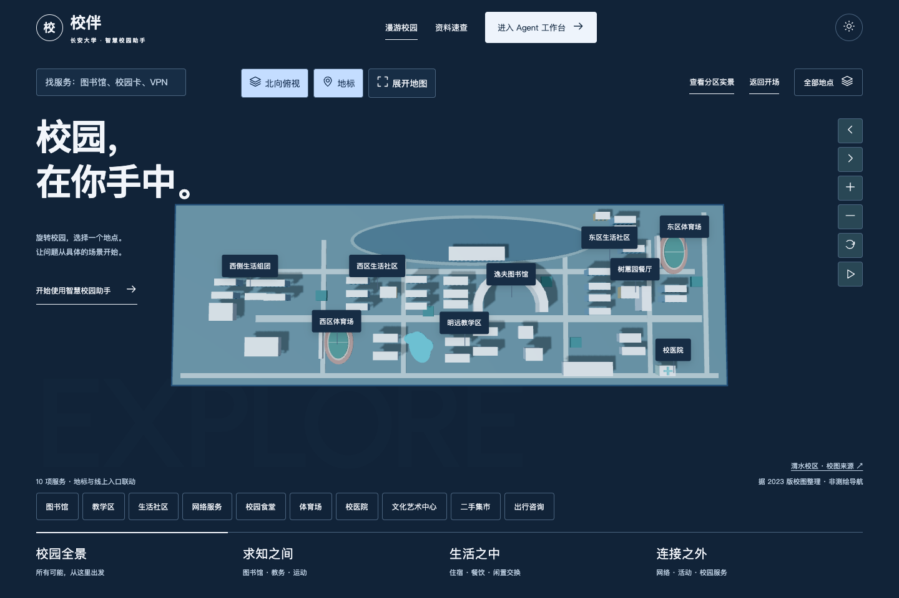

# 渭水校区地图与切换性能优化

> 本文记录布局校准和渲染优化阶段。随后完成[地标全背景实景转场](LANDMARK_FILM.md)，移除无图入口并补入三个学院组团，当前共7个有照片的入口。下文10项服务、东西社区均可点击的说明及8项旧专项是历史状态；地图相对布局和性能机制保留。最新复现使用 `tests/landmark_film_smoke.cjs`，截图为 `college-film/`。

## 依据与精度

参考长安大学团委[《青服务 | @准CHUers～，这份超全校园地图请查收！》](https://xfjy.chd.edu.cn/info/1024/12168.htm)，发布于2024-08-28，其中北校区地图标注 **Ver.2023**。原始地图存于 `assets-source/chd/weishui-map-2024.png`。文件名记录文章年份，不将其误称为2024版地图；核验日期2026-10-01。

`static/campus-layout.js` 以1888像素宽的参考图阅读坐标为基准，使用 `(x−1000)/40, (y−535)/40` 转为场景平面坐标；它们不是经纬度、测绘坐标或真实米制距离。简化建筑体量和校界，仅保留校园长条形及重要设施的相对方位。未证明2023版校图涵盖所有现状变化，不提供路径规划或实时营业状态。

| 分区 | 场景落实 |
|---|---|
| 中部偏东 | 逸夫图书馆的弧形轮廓；西侧修远教学区，南侧明远教学区，西南鸿远教学区 |
| 生活 | 西区、东区和更西侧的宿舍组团聚合为生活社区入口；23个简化体块仅用于表达组团，不宣称等于实际宿舍楼总数；社区分组不是官方命名 |
| 餐饮与运动 | 滋兰苑、树蕙园、天行健餐厅；东西两处体育场分别保留位置，共用相应服务入口 |
| 东侧与东南 | 长安文化艺术中心、校医院；保留北辰楼等背景体块 |
| 环境识别点 | 西南湖区（明远湖）、北侧汽车综合性能试验场、东西向道路骨架 |
| 线上服务 | 网络、二手、出行咨询只在服务目录出现，不绘制虚构建筑、不赋予地图坐标 |

点击东区社区时镜头停留在东区，不跳到西区；不把鸿翔园照片当作东区社区照片。原先使用的南校区北院体育场照片已取消与渭水体育场的关联。校图和学校照片均未发现明确开放商用许可，只用于本地课程演示，公开发布或再分发需确认权利。

## 性能修复

1. 移除镜头切换的固定约30fps节流，运动时由requestAnimationFrame驱动；收敛后停止绘制。开场、离屏、后台和工作台阶段不持续渲染地图。
2. 重复墙面、屋顶、窗户按材质及服务类型合为InstancedMesh；保留实例拾取，避免每扇窗一个绘制调用。
3. 静态阴影只在初始化/主题切换时更新；缓存画布与面板尺寸，不在每个动画帧读取DOM布局。标签使用transform投影，按优先级避让。
4. 选中地点不再改变画布尺寸，避免突然缩放和布局跳变。照片幕布从950ms裁剪改为600ms位移；已有Agent同页300ms进入/240ms返回继续保留。
5. 手机端地图控制横排；详情面板内部滚动，与来源链接、底部服务条分离。支持减少动画、键盘、dialog关闭和WebGL降级。

## 对比证据及限制

环境：本机Headless Chrome、SwiftShader软件WebGL、1440×960、每阶段1300ms单次合成采样。`campus_motion_profile.cjs` 在rAF采样中观察场景绘制计数；间隔为采样估计，不是GPU计时，也不是INP。

| 阶段 | 优化前绘制间隔中位数 | 优化后绘制间隔中位数 | 优化前/后末帧绘制调用 |
|---|---:|---:|---:|
| 分区镜头 | 33.3ms | 16.7ms | 386 / 50 |
| 地点聚焦 | 33.3ms | 16.7ms | 288 / 47 |

证据：[优化前](../04_Evaluation/weishui-render-before.json)、[优化后](../04_Evaluation/weishui-render-after.json)。优化前后均未在这次测试中检测到主线程长任务；问题主要证据是人为的30帧绘制上限，不声称曾测得浏览器主线程卡顿。新旧场景结构不同，绘制调用对比描述整体改造结果，不是严格单变量实验。开场和进入Agent后几乎不绘制地图是预期节能行为，不能用0间隔推导帧率。

通过15项开放日回归、8项地图专项、13项Agent导航回归和61项Python测试。未进行实体手机、不同显卡、弱网长期测试，不承诺所有设备稳定60fps。原有真实模型质量及校方接口的验收边界保持不变。

## 当前截图






## 字体与维护

中文标题使用本地17KB Noto Sans SC字形子集（600字重），由Google Fonts提供，SIL OFL许可证随资源保存为 `static/assets/campus-open-day/OFL-NotoSansSC.txt`。字形子集覆盖主要固定标题，其他文字回退到系统中文字体。来源：Google Fonts Noto Sans SC；许可证原文仓库 `google/fonts/ofl/notosanssc/OFL.txt`。主题、地图数据、样式和模型分别维护，新增真实设施先核实校图与来源，不用服务名称推断建筑地址。

复现命令（在 `02_Python_Version`，先启动本地服务并配置Playwright模块路径）：

```sh
CAMPUS_EVIDENCE_NAME=weishui node tests/open_day_smoke.cjs
node tests/weishui_layout_smoke.cjs
CAMPUS_EVIDENCE_NAME=weishui-navigation node tests/navigation_smoke.cjs
MOTION_EVIDENCE=weishui-render-after node tests/campus_motion_profile.cjs
python3 -m unittest discover -s tests
```
