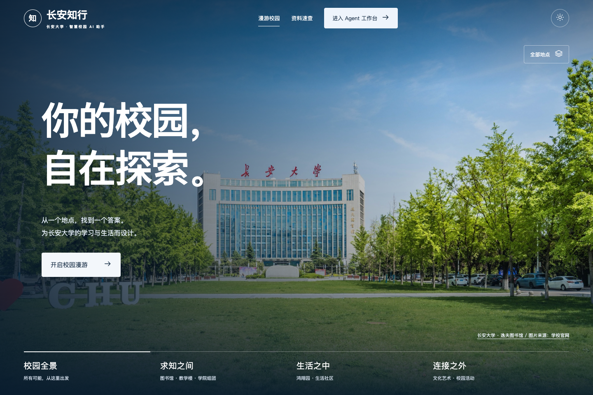

# 长安知行 · 智慧校园 AI 助手

一个本地优先的校园智能助手工作台。依据实验指导书 V3.2 实现，实验报告保持 V1.0 模板章节；本次交付不包含外部低代码平台。运行源码以 `02_Python_Version/` 为准。

系统名称为“长安知行”，副标题为“智慧校园 AI 助手”，对话中的助手简称“知行”。报告题目统一为 **《长安知行——基于 RAG 与 Agent 的校园智能客服系统》**，见[完整实验报告](05_Final_Report/final_report.md)。这是面向长安大学场景的课程项目，非校方官方服务；历史版本中的“校伴”是同一项目的旧称，旧截图与原始评测保留，不改写为新版证据。

更名验收：8项[命名与报告结构检查](04_Evaluation/zhixing_branding_results.json)、13项[导航回归](04_Evaluation/zhixing-navigation_navigation.json)及61项Python测试通过。当前首页、助手桌面/手机和实际离线问答截图独立保存在 `06_Demo/screenshots/zhixing/`；这些检查不代表真实大模型质量评测。

**新增三维助手入口：** 点击“开始使用智慧校园助手”进入可拖动、可暂停的青蓝离子核心场景。粒子聚合不阻止输入，核心随真实请求状态变化，对话开始后收拢；保留模型API配置、联网搜索、来源与会话。手机减少粒子数量，减少动画及WebGL失败有静态回退，不启用麦克风。见[交互说明与截图](06_Demo/ION_ASSISTANT.md)。10项三维专项、13项导航回归、61项Python测试通过。



首页采用“地图进入实景”的沉浸体验：点击地标，镜头推进，对应的长安大学官方照片接成全屏背景；返回时恢复之前的地图角度与缩放。当前共有7处实景入口：逸夫图书馆、修远教学楼、鸿翔园生活社区、文化艺术中心、公路学院组团、建工·材料学院组团、信息·交通学院组团。学院楼按教学科研片区整合，照片来源可逐一打开。没有实景的服务不再设置地图热点，Agent工作台原有能力不受影响。详见[地标实景转场与图片来源](06_Demo/LANDMARK_FILM.md)。

地图依据[学校发布的渭水校区地图](https://xfjy.chd.edu.cn/info/1024/12168.htm)重排。其他教学楼、东西生活组团、体育场、餐厅、校医院、湖区和试验场仍作为不带点击入口的布局背景保留。模型依照2023版校图作简化布局，不是测绘地图或实时导航。

镜头运动不再固定限为30帧；重复建筑采用实例化绘制，静态阴影只按需更新，静止时停止渲染，标签避让且缓存布局读数。照片幕布使用600ms位移转场，选中场所时不再突然改变画布大小。“进入 Agent 工作台”保留同页动画、草稿、会话与浏览器前进后退。详见[渭水地图与性能记录](06_Demo/WEISHUI_MAP_OPTIMIZATION.md)。

本轮参考与图片清单见[校园开放日设计说明](06_Demo/OPEN_DAY_DESIGN.md)。官网图片不等于免费商用素材，公开发布或再分发前需确认授权。未核实实景的场所不挪用其他照片；没有新增真实挂号、交易、校车或预约接口。

主入口：`http://127.0.0.1:7860/#agent`；完整知识空间：`http://127.0.0.1:7860/#agent-knowledge`。独立兼容入口 `/static/workbench.html` 继续保留。模型配置、知识上传、历史会话与导出功能不变。

最新转场优化将界面挂载与数据同步分开，不再等待接口返回才进入助手；进入/返回使用300/240ms双层短转场，支持快速反向切换和减少动画。专项[慢网与转场检查](04_Evaluation/navigation_motion_results.json)保存测量条件和5项检查，不能把界面出现时间当作数据完成时间。

Three.js、字体与图标均本地托管，首次安装后运行不依赖 CDN。支持减少动画、暂停场景与无 WebGL 回退。参考案例和素材许可见[沉浸式设计说明](06_Demo/IMMERSIVE_UI.md)，新测试证据见[检查记录](04_Evaluation/immersive_ui_results.json)。此前单框探索版作为完整工作台的历史界面保留，不再是首页。

## 开始使用

需要 Python 3.11+，运行时唯一第三方依赖为 Flask 3.1.3。无需下载向量数据库或模型即可体验离线模式。

```bash
cd /Users/cii/人工智能课程设计/campus-ai-service/02_Python_Version
python3 -m venv .venv
source .venv/bin/activate
python -m pip install -r requirements.txt
python app.py
```

Windows 激活命令为 `.venv\Scripts\Activate.ps1`。浏览器打开 **http://127.0.0.1:7860**。如使用 localhost，请始终使用同一地址，以保留浏览器工作空间身份。

1. 不配置密钥：可使用校园知识摘录、引用、模拟进度查询、模拟工单和多轮补参。
2. 进入 Agent 工作台后，点击侧栏「模型与连接」（手机先展开菜单）：选择供应商、检查基础地址与模型 ID、填入自己的 API Key、开启大模型并保存。可点击「保存并测试连接」，会产生一次真实 API 请求。
3. 点击「联网搜索」：允许检索公开网页。未接模型时返回搜索摘要；接入支持工具调用的模型后，由模型选择搜索并结合结果回答。
4. 在「知识空间」上传 UTF-8 `.md` / `.txt` 文档（单份 500 KB 以内）；可搜索、查看全文和删除自己的上传资料。

主页地图支持「展开地图」「北向俯视」及「地标」显隐。搜索“图书馆”“修远”“鸿翔园”等可打开实景，Enter选择首项，Escape返回；无实景的片区不再提供点击入口。实景中的「带入智能助手」保留草稿、切到长安大学资料并追加问题，**不会自动发送**。WebGL不可用时仍可从目录进入照片与工作台；照片加载失败会明确提示并保留地图服务入口。

运行当前专项：进入 `02_Python_Version/` 后执行 `node tests/landmark_film_smoke.cjs`（需Playwright、Chrome和已启动的服务）。旧 `map_explorer_smoke.cjs` 对应早期入口契约，仅作历史阶段记录。

**地点目录三组：** 求知之间（图书馆、修远）、学院与实验室（三个学院组团）、生活与文化（鸿翔园、文化艺术中心）。搜索“材料”“公路”“信息”等可直达对应照片。建筑实验中心使用中庭实景；信息组团采用信息工程学院楼外观，不冒充各学院独立楼宇。组团是探索分类而非精确楼门导航。7个视觉入口不等于7份业务知识文档，更不代表接入校方业务系统。

最新验证：13项[学院实景转场检查](04_Evaluation/college_film_results.json)、13项[Agent导航回归](04_Evaluation/college-film-navigation_navigation.json)及61项Python测试通过。当前截图位于 `06_Demo/screenshots/college-film/`。`landmark-film/` 为4入口阶段，`weishui/`、`open-day/` 等为更早阶段证据；不把旧入口计数当作本轮验收。性能记录是合成测试，不等于所有真机帧率保证。

**这里的 ChatGPT/Codex 登录不会自动提供 API 额度。** 没有有效模型密钥时，离线模式不是开放式大模型聊天。远程模型和搜索调用可能产生费用；请先核对供应商的计费和模型可用性。

## 已实现

| 功能 | 实际行为 |
|---|---|
| 校园 RAG | 12 份模拟资料 / 7 主题；章节分块、512 维 Hashing、向量+词法混合检索、阈值与来源 |
| 真实 Agent | API 模式由模型选择检索/业务工具，观察结果再回答；最多 6 轮、12 次工具请求，重复调用去重 |
| 模型接口 | Chat Completions、Responses、Anthropic Messages、Gemini generateContent 四种协议 |
| 模型预设 | OpenAI、DeepSeek、通义、智谱、Moonshot、硅基流动、OpenRouter、Claude、Gemini、Ollama、自定义 |
| 联网 | DuckDuckGo；不可用时尝试 Bing RSS（个人非商业实验）；可配置 Tavily；显示链接、摘要、检索时间与服务名 |
| 会话 | SQLite 持久化、刷新恢复、历史切换、改名、删除、Markdown 导出；模型上下文取最近 6 轮 |
| 知识管理 | 浏览、全文关键词过滤、上传、删除；浏览器工作空间之间隔离 |
| 业务服务 | 模拟状态查询、跨轮补充学号/申请号、用户明确请求才建立模拟人工工单 |
| UI | 冷蓝科技风、同页校园/Agent 转场、响应式导航、明暗主题、来源侧栏、执行状态、停止、复制、重新编辑提问 |
| 安全 | 本机 Host 限制、同源写入检查、HttpOnly/SameSite Cookie、CSP、纯文本安全渲染、参数和上传校验 |

四种协议经过 Mock 测试，**并非已逐一连接所有供应商的真实账号**。预设模型 ID 是可编辑起点，使用前以供应商当前可用列表为准。选择支持 tool/function calling 的模型；不支持时会明确报错，不会伪装执行工具。Responses 适用于使用该协议的 OpenAI 模型；Ollama 需事先在本机运行并拉取支持工具的模型。

## 架构与数据

```text
浏览器工作台 → Flask 同源 API → Workbench
                                 ├─ 四协议模型适配 → 有界 Tool Loop
                                 ├─ search_knowledge → HybridRetriever → 内存向量索引
                                 ├─ search_web → 公开搜索 / Tavily
                                 ├─ query_application_status / handoff_to_human
                                 └─ SQLite：会话、上传文本、非敏感设置、模拟业务记录
```

向量索引为 **InMemoryVectorStore，不是 SQLite 向量库**。Hashing Embedding 用于原理复现，不等同于预训练语义 Embedding。长文分块包含硬长度上限；上传资料不会混入冻结的 12 文档课程评测。

界面中填写的模型 Key 和 Tavily Key 仅留在服务端进程内存，重启后需重新填写；不写入 localStorage、数据库或 Git。非敏感连接设置保存在 `data/workbench.db`；同文件包含持久化会话身份签名密钥，应视为私有运行数据，不分享、不提交。删除浏览器 Cookie 会丢失对旧工作空间的访问。

可选 `.env` 配置：复制 `.env.example`，按需设置 `LLM_MODE=api`、`LLM_PROTOCOL`、`LLM_BASE_URL`、`LLM_MODEL`、`LLM_API_KEY`、`TAVILY_API_KEY`。环境配置作为新工作空间的初始值；网页设置优先。`.env` 不提交仓库。不要把密钥发在聊天内容里。

开启远程模型后，最近会话及必要的知识/工具结果会发给该提供商；开启联网后，搜索词会发给搜索服务。不应上传真实个人敏感信息。这里的浏览器身份隔离不是完整校园 SSO 或生产级权限系统。

## 测试和实验材料

```bash
# 在 02_Python_Version 中
python -m unittest discover -s tests -v

# 新版验收结果写入独立 v2 目录，不覆盖历史证据
python -m src.evaluation.workbench_check

# 可选：真实联网冒烟测试（会访问公开搜索服务）
python -m src.evaluation.workbench_check --live-web

# 可选 UI 验收：需要 Node.js、Playwright 和 Chrome；应用须已启动
NODE_PATH=/path/to/node_modules node tests/browser_smoke.cjs
# 添加 CAMPUS_LIVE_WEB=1 可同时检验网页端真实联网
```

最新前端优化通过 13 项[同页导航检查](04_Evaluation/agent_navigation_results.json)、19 项[独立工作台回归](04_Evaluation/agent-navigation-regression/browser_results.json)，Python 单测 55 项通过。运行导航检查：`NODE_PATH=/path/to/node_modules node tests/navigation_smoke.cjs`。覆盖草稿、往返、会话同步、真实本地 RAG、深色主题、手机、减少动画及无转场 API 回退，不代表真实外部 LLM 质量或设备帧率。

此前 V2 Python 与浏览器结果见 [V2 验收报告](05_Final_Report/PRODUCT_V2_ACCEPTANCE.md) 和 `04_Evaluation/v2/`。浏览器测试使用隔离上下文，不读取现有浏览器账号，并在结束时删除自己创建的模拟会话与上传。

`04_Evaluation/` 根目录保留 2026-09-25 的冻结离线证据：20 题、小规模自构数据、确定性摘录器；100% 指标与 0.26 ms 平均延迟只属于该实验条件，**不代表真实 LLM、互联网搜索或全校园部署的质量和性能**。本次不重写旧 JSON/CSV，不覆盖人工评分表。

当前学校为**长安大学**。工作台新会话默认使用[长安大学官方资料摘要](02_Python_Version/data/public_corpus/chd_2026_10/README.md)，当前6份、5类主题，附官方URL和日期；课程模拟与个人上传须切换资料范围，切换会开启新对话并保留草稿，历史会话不删除。首页校园场景与轻问答仍明确标记为模拟教学，不是真实长安大学地图或官方服务。6份本校资料尚未达到指导书至少10份要求，后续需继续补齐与独立评测。

[上海交通大学示例集](02_Python_Version/data/public_corpus/sjtu_2026_10/README.md)仅为历史独立实验，不接入当前在线助手。`python -m src.evaluation.public_corpus_check`仍仅运行这套旧示例；其Recall@1为90%、Recall@3/5为95%的[历史结果](04_Evaluation/public_corpus_v1/hashing_baseline.json)不代表长安大学语料质量。语义Embedding对比和真实模型生成仍未完成。

学校适配验证：`python -m unittest discover -s tests -q`（61项），`node tests/school_scope_smoke.cjs`（需Playwright，8项）。截图见 `06_Demo/screenshots/chd/`，浏览器记录见 [学校范围回归](04_Evaluation/chd_scope_results.json)。

重新运行原评测会覆盖旧输出，若需要请先备份：`python -m src.evaluation.runner`。真实 2 Prompt × 5 Question 实验通过 `python -m src.evaluation.prompt_runner` 单独执行（该旧实验脚本使用 Chat Completions 环境配置）；未配置密钥不会伪造结果。人工评分与本人信息仍需真实提交者确认。

## 演示问题

- `图书馆周末几点开馆？` → `它工作日呢？`
- `查询申请进度` → `S1001` → `AP2026001`
- `请转人工客服，我需要咨询奖学金材料复核。`
- 离线：`明天一食堂的菜单是什么？`（无数据，不编造）
- 开启联网：`Python 官方文档在哪里？`（查看原网页与检索日期）
- 配置大模型：`帮我规划一个 Python 入门学习计划。`

## 目录与交付文件

| 目录 | 用途 |
|---|---|
| `02_Python_Version/` | 当前 V2 可运行系统、单测、知识文档 |
| `03_AI_Coding_Version/` | 任务与开发记录；`source/` 保留 V1 历史源码快照，不作为当前启动入口 |
| `04_Evaluation/` | V1 冻结证据；`v2/` 为本次独立回归与浏览器结果 |
| `05_Final_Report/` | [模板化实验报告](05_Final_Report/final_report.md)、V2 验收和历史审计 |
| `06_Demo/` | 演示脚本、界面说明、`screenshots/v2/` 新截图 |
| `release/` | 旧 V1.1 的证据治理记录；不把旧提交 SHA 当作 V2 版本号 |

## 已知边界

- 业务数据与工单全为教学模拟，不会发送给真实客服。没有支付、真实登录、校车定位、实时食堂数据。
- 公开搜索可能限流、跳转或返回无关结果；时间戳表示检索时间，不是网页发布时间。失败会提示，不会编造网页。Bing RSS 仅用于个人非商业课程实验，商用应改用有相应许可的搜索 API。
- SSE 传输真实执行状态与最终回答，**不是逐 token 输出**。停止阻止后续步骤，但不能立即中断已经发出的 HTTP 请求，通常最多再等 30 秒；已创建的模拟工单不自动回滚。
- 引用存在性校验、参数校验和提示词隔离能降低风险，不能保证模型永不幻觉或完全抵抗提示注入。
- 默认 Flask 本机开发服务不适合公网部署；生产需要认证、TLS、限流、隐私治理、持久化任务与授权业务接口。
