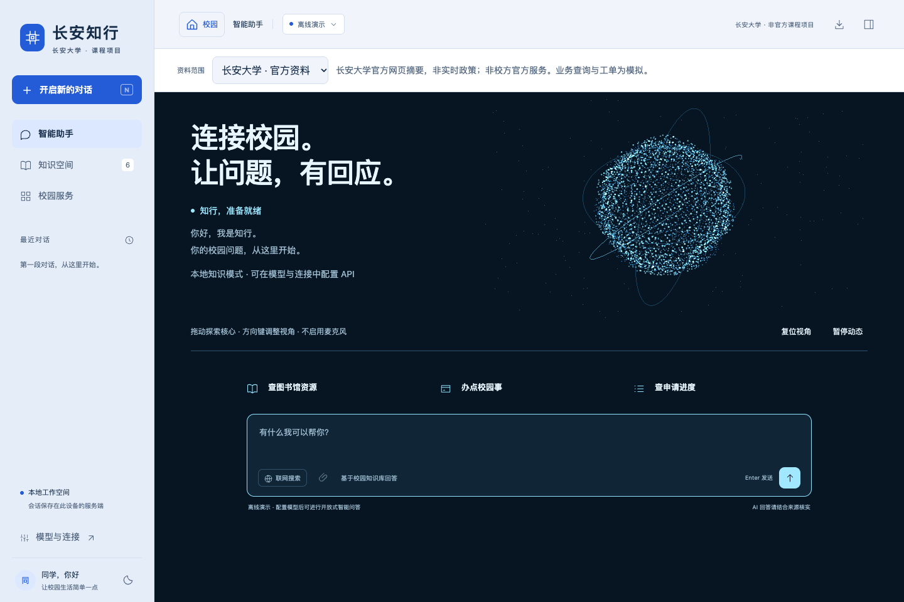
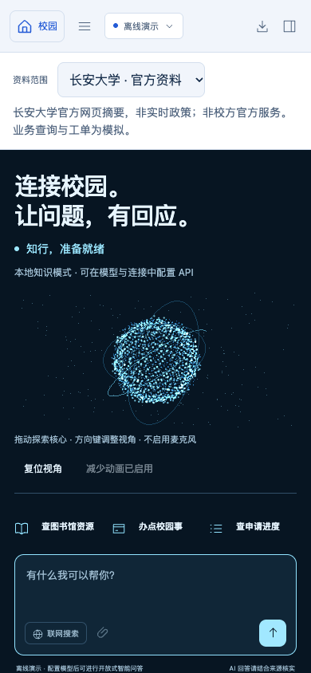

<div align="center">

# 长安知行

### 基于 RAG 与 Agent 的智慧校园 AI 助手

[](https://www.python.org/)
[](02_Python_Version/requirements.txt)
[](04_Evaluation/zhixing_branding_results.json)
[](05_Final_Report/final_report.md)

面向长安大学校园场景的本地优先智能服务系统，集沉浸式校园探索、RAG 知识问答、Agent 工具调用、多模型 API 适配与可解释来源展示于一体。

[快速开始](#快速开始) · [功能概览](#功能概览) · [实验报告](05_Final_Report/final_report.md) · [演示说明](06_Demo/demo_script.md)

</div>

> [!IMPORTANT]
> 本仓库是课程设计项目，并非长安大学官方系统。业务数据、进度查询和人工工单均为教学模拟；校园图片来自公开网页，公开发布或再分发前请再次确认授权。


## 项目简介

“长安知行”以校园知识问答为核心，把传统聊天框扩展成一套完整的智慧校园体验：用户可以在长安大学渭水校区主题页面中探索实景地点，再将场景问题带入 Agent 工作台；系统通过混合检索找到依据，调用受约束的工具，并在回答旁展示来源与执行状态。

默认离线模式无需 API Key 即可运行，适合课程展示和 RAG 原理复现。配置个人模型 API 后，可启用多轮 Agent、联网搜索和开放式问答。

## 界面预览

| 智慧校园 Agent | 手机端适配 |
|---|---|
|  |  |

更多实景地图、地点转场、知识空间和模型设置截图见 [06_Demo/screenshots](06_Demo/screenshots/)。

## 功能概览

| 模块 | 已实现能力 |
|---|---|
| 沉浸式校园 | 长安大学主题实景开场、渭水校区相对布局、7 个实景地点、全屏目录与场景转场 |
| 校园 RAG | 文档加载与分块、512 维 Hashing Embedding、向量与词法混合检索、阈值控制、来源引用和未知问题处理 |
| Agent | 模型自主选择知识检索、联网搜索、模拟进度查询及人工转接工具；限制循环轮数并阻止重复调用 |
| 多模型 API | OpenAI Chat Completions、OpenAI Responses、Anthropic Messages、Gemini generateContent 四类协议 |
| 模型预设 | OpenAI、DeepSeek、通义千问、智谱、Moonshot、硅基流动、OpenRouter、Claude、Gemini、Ollama及自定义服务 |
| 联网问答 | DuckDuckGo、Bing RSS 回退及可选 Tavily；展示链接、摘要、检索时间与服务来源 |
| 知识管理 | 浏览和搜索知识文档，上传或删除个人 `.md` / `.txt` 资料，资料范围彼此隔离 |
| 会话工作台 | SQLite 持久会话、历史切换、重命名、删除、Markdown 导出、来源侧栏、停止与重新编辑 |
| 响应式 UI | 桌面与手机布局、明暗主题、同页无刷新切换、减少动画偏好、WebGL 静态回退 |
| 本地安全 | 本机 Host 限制、同源写入检查、CSP、安全 Cookie、纯文本渲染、上传与工具参数校验 |

## 快速开始

### 环境要求

- Python 3.11 或更高版本
- 支持现代 JavaScript 与 WebGL 的浏览器
- 可选：Node.js、Playwright 和 Chrome，用于运行浏览器自动化测试

### macOS / Linux

```bash
git clone https://github.com/chilingche1111-blip/guide_agent_professor.git
cd guide_agent_professor/02_Python_Version

python3 -m venv .venv
source .venv/bin/activate
python -m pip install -r requirements.txt
python app.py
```

### Windows PowerShell

```powershell
git clone https://github.com/chilingche1111-blip/guide_agent_professor.git
cd guide_agent_professor\02_Python_Version

py -m venv .venv
.\.venv\Scripts\Activate.ps1
python -m pip install -r requirements.txt
python app.py
```

启动后访问：

- 校园首页：<http://127.0.0.1:7860/>
- Agent 工作台：<http://127.0.0.1:7860/#agent>
- 知识空间：<http://127.0.0.1:7860/#agent-knowledge>
- 健康检查：<http://127.0.0.1:7860/api/health>

> [!TIP]
> 不配置任何密钥也可以体验本地知识问答、来源引用、模拟进度查询和模拟工单。页面中的“模型与连接”支持直接填写个人 API 配置，密钥仅保存在当前服务进程内存中。

## 配置模型 API

推荐在 Agent 工作台的“模型与连接”界面中选择协议、供应商和模型，并使用“保存并测试连接”验证配置。测试会产生一次真实 API 请求，可能产生费用。

也可以在运行目录创建本地配置文件：

```bash
cp .env.example .env
```

```dotenv
LLM_MODE=api
LLM_PROTOCOL=openai
LLM_BASE_URL=https://api.openai.com/v1
LLM_MODEL=gpt-4.1-mini
LLM_API_KEY=your_api_key
TAVILY_API_KEY=
```

`LLM_PROTOCOL` 支持：

| 值 | 接口协议 |
|---|---|
| `openai` | OpenAI Chat Completions 兼容接口 |
| `responses` | OpenAI Responses API |
| `anthropic` | Anthropic Messages API |
| `gemini` | Google Gemini generateContent API |

ChatGPT 或 Codex 订阅不会自动提供 API 额度。请使用对应服务商签发的密钥，并以服务商当前模型列表和计费说明为准。不要提交 `.env`，也不要在对话内容中发送密钥。

## 使用方式

1. 从首页进入校园漫游，在地图或全屏地点目录中选择图书馆、教学楼、生活社区或学院组团。
2. 点击“带入智能助手”，系统会切换到对应资料范围并保留问题草稿，不会自动发送。
3. 在 Agent 工作台中选择长安大学官方资料、课程模拟资料或个人上传资料。
4. 根据需要开启联网搜索或配置模型 API；回答完成后可查看来源、执行过程并导出 Markdown 记录。

可用于演示的问题：

```text
图书馆周末几点开馆？
查询申请进度
请转人工客服，我需要咨询奖学金材料复核。
明天一食堂的菜单是什么？
```

最后一题用于验证未知问题处理：离线知识库没有可靠依据时，系统应明确说明无法确认，而不是编造答案。

## 系统架构

```text
浏览器
  ├─ 沉浸式校园 / 地点实景 / 移动端界面
  └─ Agent 工作台
         ↓ Flask 同源 API
      Workbench
         ├─ 四协议模型适配 → 有界 Tool Loop
         ├─ search_knowledge → HybridRetriever → 内存向量索引
         ├─ search_web → 公开搜索 / Tavily
         ├─ query_application_status / handoff_to_human
         └─ SQLite → 会话、上传文本、非敏感设置与模拟记录
```

本项目使用内存向量索引和 Hashing Embedding 复现检索流程，不等同于生产级向量数据库或预训练语义向量模型。

## 项目结构

```text
guide_agent_professor/
├── 02_Python_Version/       # 当前可运行系统、API、前端、知识库与测试
├── 03_AI_Coding_Version/    # 开发任务和 AI 协作记录
├── 04_Evaluation/           # 冻结评测、回归测试与原始证据
├── 05_Final_Report/         # 完整实验报告与一致性审查
├── 06_Demo/                 # 演示脚本、设计说明、图片来源与截图
├── DESIGN.md                # 视觉与交互设计规范
├── PRODUCT.md               # 产品定位和能力边界
└── README.md
```

## 测试

在 `02_Python_Version` 目录运行：

```bash
# Python 单元测试
python -m unittest discover -s tests -v

# 当前工作台验收
python -m src.evaluation.workbench_check

# 可选：访问公开搜索服务的联网冒烟测试
python -m src.evaluation.workbench_check --live-web
```

浏览器测试需要先启动应用，并在本机安装 Playwright 与 Chrome：

```bash
node tests/branding_smoke.cjs
node tests/navigation_smoke.cjs
```

当前记录为 61 项 Python 测试、8 项命名与报告结构检查、13 项导航回归通过。原始结果保存在 [04_Evaluation](04_Evaluation/)；这些结果只说明当前代码和课程数据条件下的行为，不代表真实大模型质量或全校园部署性能。

## 文档

- [完整实验报告](05_Final_Report/final_report.md)
- [项目验收说明](05_Final_Report/PRODUCT_V2_ACCEPTANCE.md)
- [Agent API 说明](02_Python_Version/reports/WORKBENCH_API.md)
- [三维助手交互说明](06_Demo/ION_ASSISTANT.md)
- [地标实景与图片来源](06_Demo/LANDMARK_FILM.md)
- [渭水地图与性能记录](06_Demo/WEISHUI_MAP_OPTIMIZATION.md)
- [设计系统](DESIGN.md)

## 数据、隐私与安全

- `.env`、运行数据库、日志、虚拟环境和个人密钥均由 `.gitignore` 排除。
- 模型 Key 和 Tavily Key 只保留在服务端进程内存中，重启后需要重新填写。
- 开启远程模型后，必要的会话、知识片段和工具结果会发送给所选提供商；开启联网后，查询词会发送给搜索服务。
- 请勿上传真实学号、身份证件、联系方式或其他个人敏感信息。
- 浏览器工作空间隔离并非校园统一身份认证，不应直接用于生产部署。

## 已知边界

- 长安大学资料当前为公开网页摘要，覆盖范围有限，不代表完整或实时校方政策。
- 校园地图是依据公开校图制作的相对布局，不是测绘地图或实时导航。
- 业务查询、人工转接、食堂、校车、支付与预约均未接入真实校方系统。
- 四类协议已通过 Mock 测试，但没有使用私人密钥对所有供应商逐一进行真实横向评测。
- 默认 Flask 开发服务器仅允许本机访问，不适合直接部署到公网；生产环境仍需认证、TLS、限流、隐私治理和正式业务授权。

## 素材与第三方组件

界面使用本地托管的 Three.js、Lucide 图标、Urbanist 与 Noto Sans SC 字体，相关许可文件保存在对应资源目录。长安大学校园照片与来源清单见 [校园开放日设计说明](06_Demo/OPEN_DAY_DESIGN.md) 和 [素材说明](02_Python_Version/static/assets/README.md)。校方网页图片不因此自动获得开源或商业再分发许可。

---

<div align="center">

**长安知行 · 让校园问题有据可查，让服务过程可见。**

</div>
